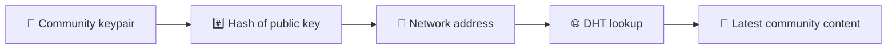
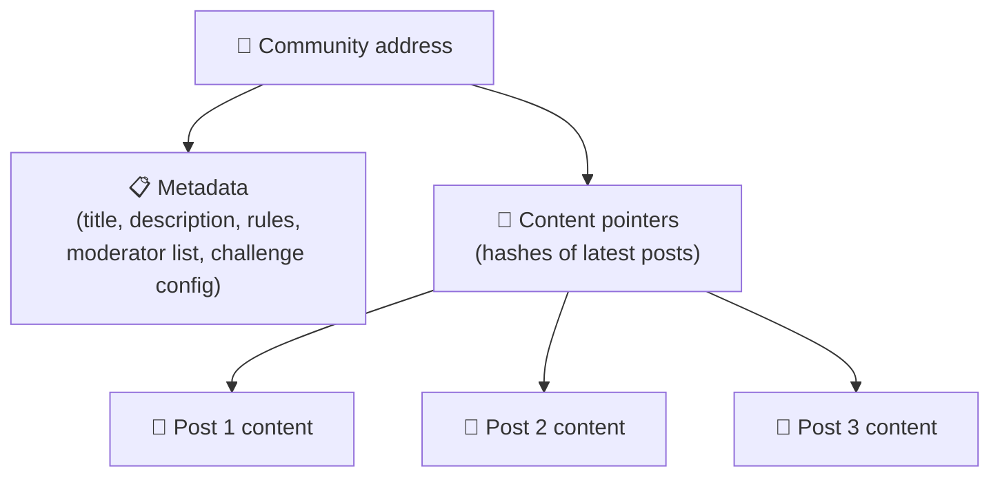
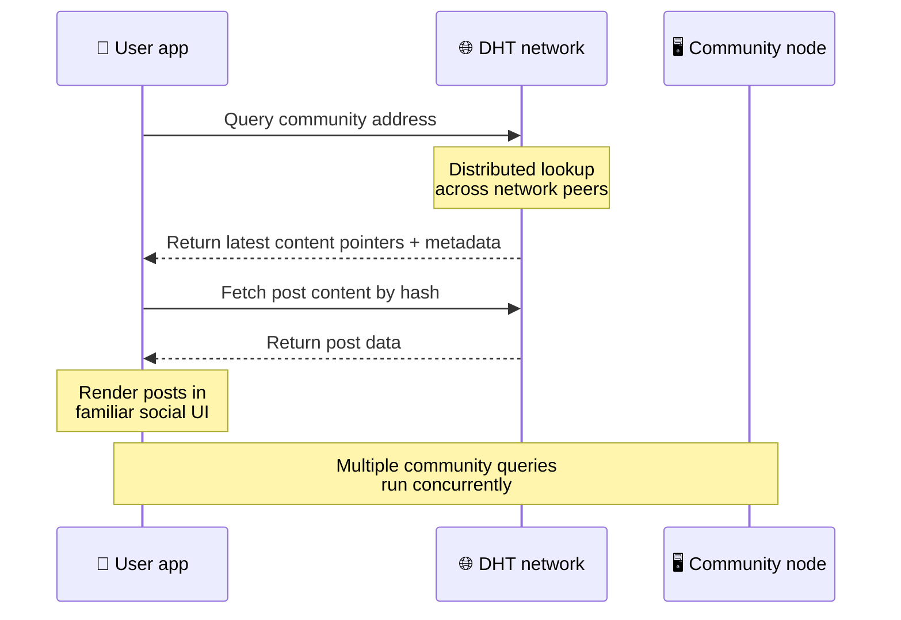
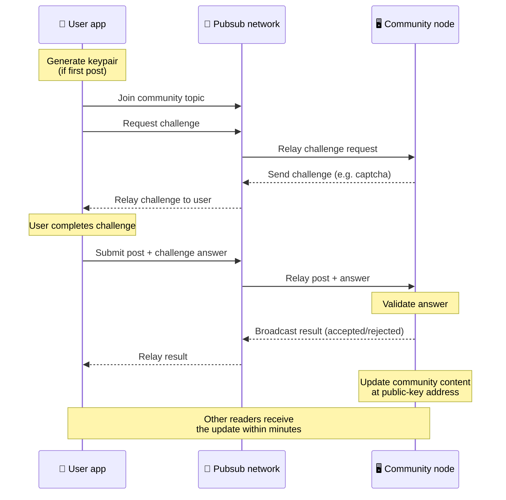
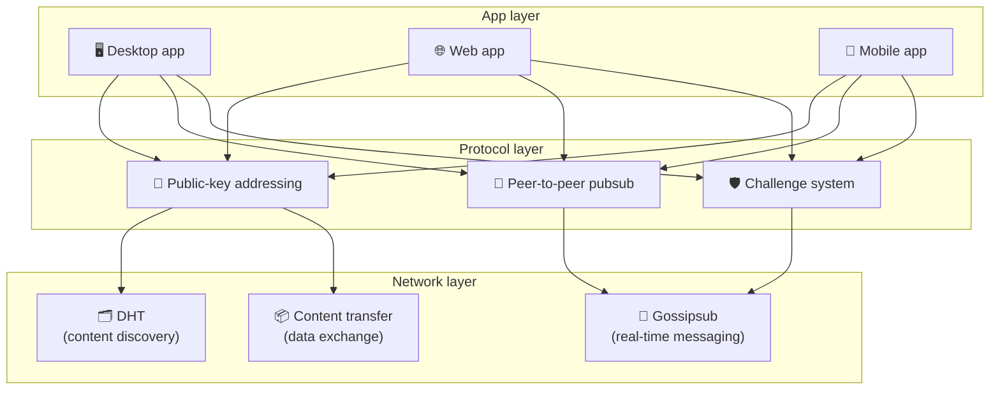

# Peer-to-Peer Protocol

Bitsocial does not use a blockchain, a federation server, or a centralized backend. Instead it
combines two ideas — **public-key-based addressing** and **peer-to-peer pubsub** — to let anyone
host a community from consumer hardware while users read and post without accounts on any
company-controlled service.

## The two problems

A decentralized social network has to answer two questions:

1. **Data** — how do you store and serve the world's social content without a central database?
2. **Spam** — how do you prevent abuse while keeping the network free to use?

Bitsocial solves the data problem by skipping the blockchain entirely: social media does not need
global transaction ordering or permanent availability of every old post. It solves the spam problem
by letting each community run its own anti-spam challenge over the peer-to-peer network.

---

## Public-key-based addressing

In BitTorrent, a file's hash becomes its address (_content-based addressing_). Bitsocial uses a
similar idea with public keys: the hash of a community's public key becomes its network address.

Any peer on the network can perform a DHT (distributed hash table) query for that address and
retrieve the community's latest state. Each time the content is updated, its version number
increases. The network only keeps the latest version — there is no need to preserve every historical
state, which is what makes this approach lightweight compared to a blockchain.

### What gets stored at the address

The community address does not contain full post content directly. Instead it stores a list of
content identifiers — hashes that point to the actual data. The client then fetches each piece of
content through the DHT or tracker-style lookups.

At least one peer always has the data: the community operator's node. If the community is popular,
many other peers will have it too and the load distributes itself, the same way popular torrents are
faster to download.

---

## Peer-to-peer pubsub

Pubsub (publish-subscribe) is a messaging pattern where peers subscribe to a topic and receive
every message published to that topic. Bitsocial uses a peer-to-peer pubsub network — anyone can
publish, anyone can subscribe, and there is no central message broker.

To publish a post to a community, a user publishes a message whose topic equals the community's
public key. The community operator's node picks it up, validates it, and — if it passes the
anti-spam challenge — includes it in the next content update.

---

## Anti-spam: challenges over pubsub

An open pubsub network is vulnerable to spam floods. Bitsocial solves this by requiring publishers
to complete a **challenge** before their content is accepted.

The challenge system is flexible: each community operator configures their own policy. Options
include:

| Challenge type    | How it works                                      |
| ----------------- | ------------------------------------------------- |
| **Captcha**       | Visual or interactive puzzle presented in the app |
| **Rate limiting** | Limit posts per time window per identity          |
| **Token gate**    | Require proof of balance of a specific token      |
| **Payment**       | Require a small payment per post                  |
| **Allowlist**     | Only pre-approved identities can post             |
| **Custom code**   | Any policy expressible in code                    |

Peers that relay too many failed challenge attempts get blocked from the pubsub topic, which
prevents denial-of-service attacks on the network layer.

---

## Lifecycle: reading a community

This is what happens when a user opens the app and views a community's latest posts.

**Step by step:**

1. The user opens the app and sees a social interface.
2. The client joins the peer-to-peer network and makes a DHT query for each community the user
   follows. Queries take a few seconds each but run concurrently.
3. Each query returns the community's latest content pointers and metadata (title, description,
   moderator list, challenge configuration).
4. The client fetches the actual post content using those pointers, then renders everything in a
   familiar social interface.

---

## Lifecycle: publishing a post

Publishing involves a challenge-response handshake over pubsub before the post is accepted.

**Step by step:**

1. The app generates a keypair for the user if they don't have one yet.
2. The user writes a post for a community.
3. The client joins the pubsub topic for that community (keyed to the community's public key).
4. The client requests a challenge over pubsub.
5. The community operator's node sends back a challenge (for example, a captcha).
6. The user completes the challenge.
7. The client submits the post along with the challenge answer over pubsub.
8. The community operator's node validates the answer. If correct, the post is accepted.
9. The node broadcasts the result over pubsub so network peers know to continue relaying
   messages from this user.
10. The node updates the community's content at its public-key address.
11. Within a few minutes, every reader of the community receives the update.

---

## Architecture overview

The full system has three layers that work together:

| Layer        | Role                                                                                                                                      |
| ------------ | ----------------------------------------------------------------------------------------------------------------------------------------- |
| **App**      | User interface. Multiple apps can exist, each with its own design, all sharing the same communities and identities.                       |
| **Protocol** | Defines how communities are addressed, how posts are published, and how spam is prevented.                                                |
| **Network**  | The underlying peer-to-peer infrastructure: DHT for discovery, gossipsub for real-time messaging, and content transfer for data exchange. |

---

## Privacy: unlinking authors from IP addresses

When a user publishes a post, the content is **encrypted with the community operator's public key**
before it enters the pubsub network. This means that while network observers can see that a peer
published _something_, they cannot determine:

- what the content says
- which author identity published it

This is similar to how BitTorrent makes it possible to discover which IPs seed a torrent but not who
originally created it. The encryption layer adds an additional privacy guarantee on top of that
baseline.

---

## Browser users and gateways

Browsers cannot join peer-to-peer networks directly. Bitsocial handles this with **HTTP gateways**
that relay data between the P2P network and browser clients. These gateways:

- can be run by anyone
- do not require user accounts or payments
- do not gain custody over user identities or communities
- can be swapped out without losing data

This keeps the browser experience seamless while preserving the decentralized architecture
underneath.

---

## Why not a blockchain?

Blockchains solve the double-spend problem: they need to know the exact order of every transaction
to prevent someone from spending the same coin twice.

Social media does not have a double-spend problem. It does not matter if post A was published one
millisecond before post B, and old posts do not need to be permanently available on every node.

By skipping the blockchain, Bitsocial avoids:

- **gas fees** — posting is free
- **throughput limits** — no block size or block time bottleneck
- **storage bloat** — nodes only keep what they need
- **consensus overhead** — no miners, validators, or staking required

The tradeoff is that Bitsocial does not guarantee permanent availability of old content. But for
social media, that is an acceptable tradeoff: the community operator's node holds the data, popular
content spreads across many peers, and very old posts naturally fade — the same way they do on every
social platform.

## Why not federation?

Federated networks (like email or ActivityPub-based platforms) improve on centralization but still
have structural limitations:

- **Server dependency** — each community needs a server with a domain, TLS, and ongoing
  maintenance
- **Admin trust** — the server admin has full control over user accounts and content
- **Fragmentation** — moving between servers often means losing followers, history, or identity
- **Cost** — someone has to pay for hosting, which creates pressure toward consolidation

Bitsocial's peer-to-peer approach removes the server from the equation entirely. A community node
can run on a laptop, a Raspberry Pi, or a cheap VPS. The operator controls moderation policy but
cannot seize user identities, because identities are keypair-controlled, not server-granted.

---

## Summary

Bitsocial is built on two primitives: public-key-based addressing for content discovery, and
peer-to-peer pubsub for real-time communication. Together they produce a social network where:

- communities are identified by cryptographic keys, not domain names
- content spreads across peers like a torrent, not served from a single database
- spam resistance is local to each community, not imposed by a platform
- users own their identities through keypairs, not through revocable accounts
- the whole system runs without servers, blockchains, or platform fees
